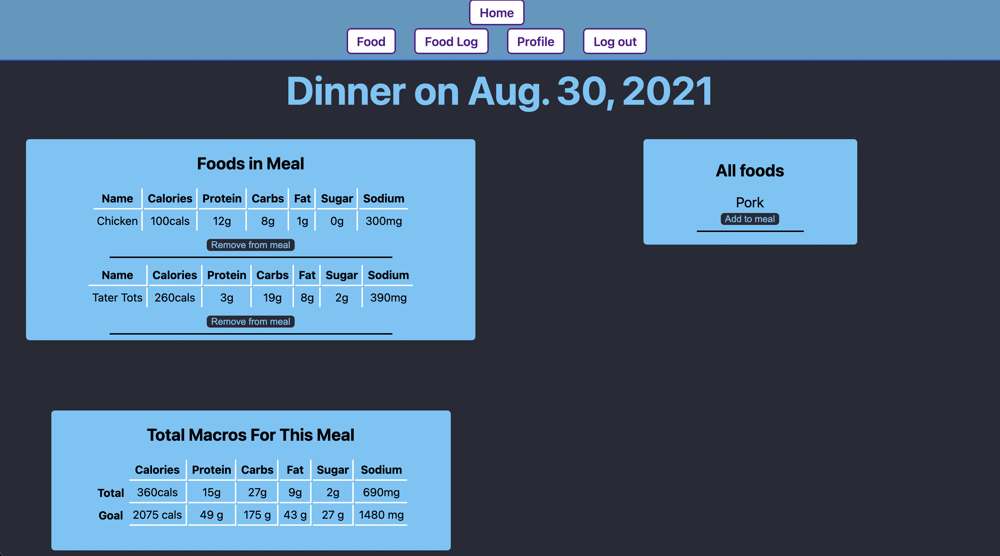

# The Hustle

## What is The Hustle?
The Hustle is a food macro tracker that allows you to add to see how the food you eat on a daily basis affects your personal goal. 

## Getting Started
Check out The Hustle [here](https://the-hustle.herokuapp.com/)

Check out my Trello board [here](https://trello.com/b/eDRGjoRD/the-hustle)

## Screenshots

## Technologies Used
The technologies I used to create this project are:

* Django
* Python
* PostgreSQL
* HTML
* CSS
* JavaScript

## IceBox
Here are some of the things I would like to add in the future:

* Implement AWS for photo uploads
* Add exercise and burned calories
* Render different pages based off of the date
* Allow users to update their profile info